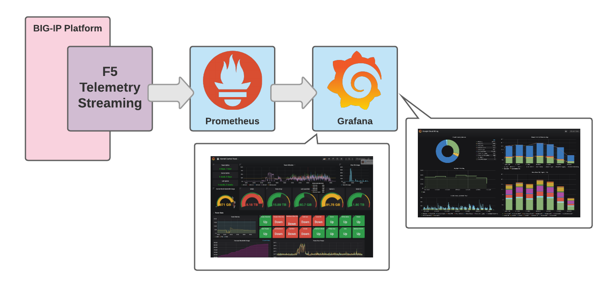

Welcome to the Git repository for the UDF F5 Telemetry Streaming with Prometheus & Grafana lab and lab guide.  

**Lab goals:**

- Demonstrate Robust F5 **BIG-IP visibility** and metrics for F5 BIGIP using **F5 Telemetry Streaming** with **Prometheus & Grafana**. 

**Other goals:** 

- Leverage **DevOps tools** and **Declarative APIs** 
- Demonstrate deploying a Telemetry Streaming **Pull Target** configuration via F5 Automation Toolchain API

   
.. note :: 
   For any comments or questions, please send a Teams chat to Gee Chow.
