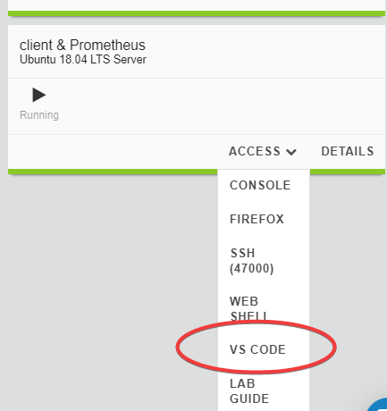

Module 1 - Using DevOps tools    
==============================

**Goals**: 
----------------
-  Become familair with VS Code
-  Connect the F5 VS Code Extension wit the BIG-IP instance

**Steps**

- Acess VS Code (web edition) in your UDF by going to: **Components > "Client & Prometheus" System Component > Access > VS Code** 

- In VS Code, click the F5 Extension icon to the the Extension view. Verify that a host (F5 device) has already been added named "admin@10.1.1.7" and click on the name to connect.
- Enter the password in the prompt: F5d3vops$. You are now connected to the device.
- Click an are next to the "welcome" tab to open a new file window. Paste 
