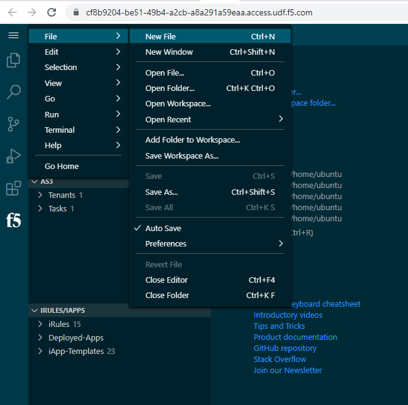

Section 2 - Send a Telemetry Streaming Declaration    
==================================================

**Goals**: 
----------------
-  Send a TS declaration to configure a TS Pull consumer target
-  Verify success and view metrics available 

**Steps**

- Create a new file: in VS Code, click the hamburger icon (3 lines icon) > file > select "New File". 

- Copy the follow TS declaration and paste it to the new file window:
 
.. literalinclude:: ts-pull.json
  :language: JSON

- Right-click the pasted JSON and select "Post as TS Declaration":

.. image:: vscode-ts-code.png
   :alt: VS Code ts

- In VS Code, click the F5 Extension icon to the the Extension view. Verify that a host (F5 device) has already been added named "admin@10.1.1.7" and click on the name to connect.
- Enter the password in the prompt (see the Details sections for the BIG-IP in UDF for the password). You are now connected to the device.

.. image:: udf-vscode.png
   :alt: VS Code in UDF

- Click an are next to the "welcome" tab to open a new file window. Paste 
