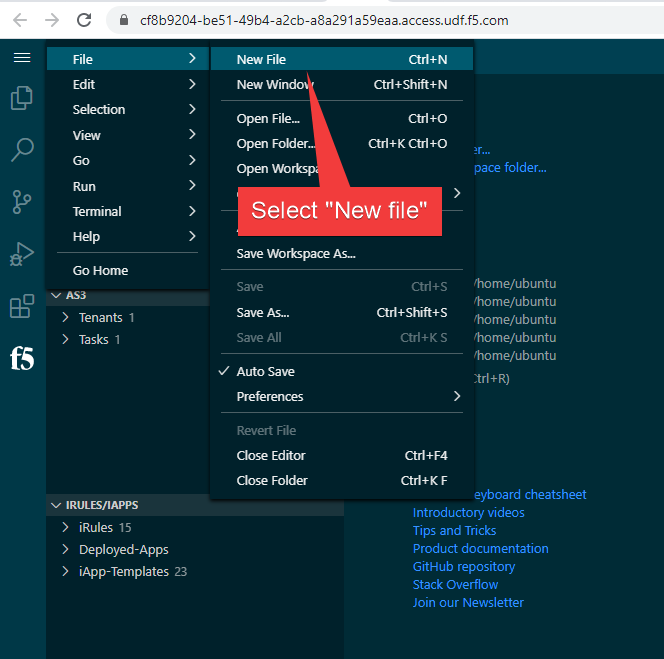
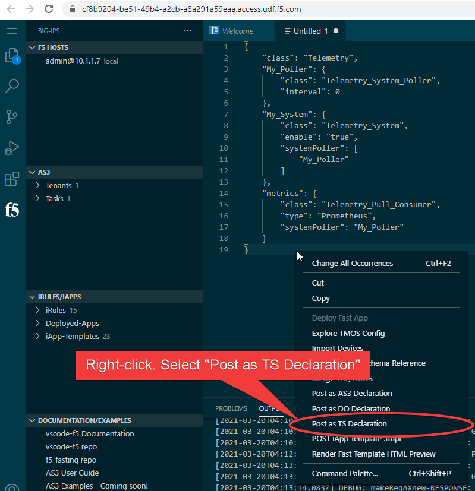
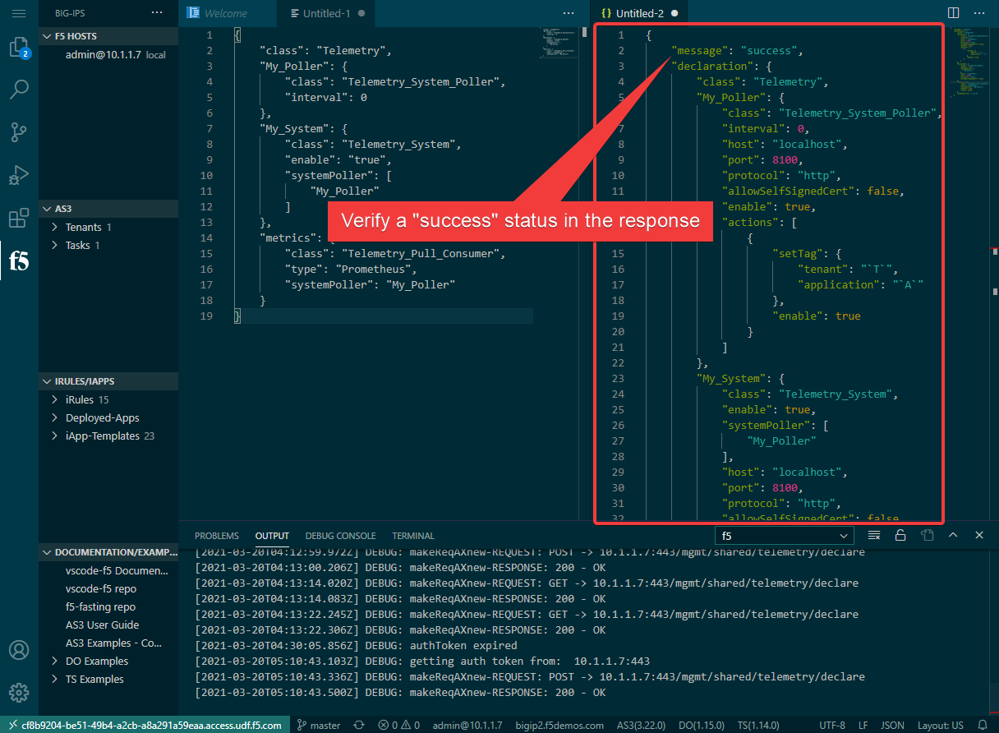

Section 2 - Send a Telemetry Streaming Declaration    
==================================================

**Goals**: 

-  Send a TS declaration to configure a TS Pull consumer target
-  Verify success and view metrics available 

**Steps:**

- Create a new file: in VS Code, click the hamburger icon (3 lines icon) > select "File" > select "New File". 

- Copy the follow TS declaration and paste it to the new file window:
 
.. literalinclude:: ts-pull.json
  :language: JSON

- Right-click the pasted JSON and select "Post as TS Declaration":

- Upon successful post of the declaration, a response from the system will appear as a new file. Verify a "success" message value. You have now successfully posted the TS declaration to create a Pull target consumer on the BIG-IP. 

