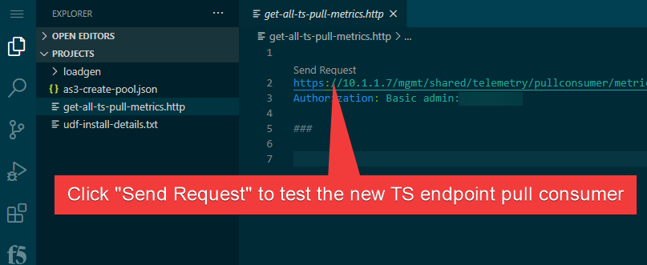
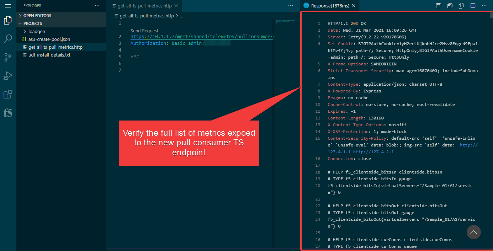

Section 3 - Verify available Metrics 
====================================

**Goals**: 

- Verify the available metrics that will be pulled via Prometheus and Grafana.

**Steps**: 

- In VS Code, open this file named "get-all-ts-pull-metrics.http" already saved in the VS Code system instance. The REST-Client Extension is installed in the UDF's VS Code which we will be used to verify the TS metrics.
  

- Click the "Send Request" button about the GET request. A JSON respose from the TS Pull Consumer end-point will return. This is the list of metrics that will be made availbe to the Prometheus consumer.

- A response from the API call will appear. This is a raw output of the pull consumer you just created that will be pulled by Prometheus & Grafana.
 

